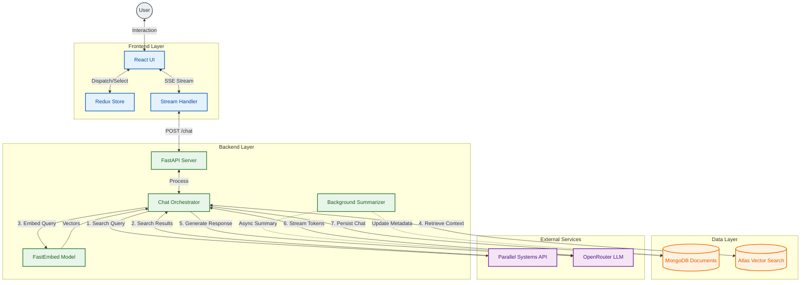

# Cipher

## Overview

Cipher is an advanced AI Research Assistant designed to provide accurate, context-aware answers by combining real-time web search with Large Language Model (LLM) capabilities. It utilizes a Retrieval-Augmented Generation (RAG) architecture to ground its responses in verifiable data, ensuring high reliability for research tasks.

## Key Features

*   **Hybrid Retrieval System**: Combines semantic vector search with keyword-based search to retrieve the most relevant information from the web.
*   **Contextual Intelligence**: Maintains full conversation history to understand follow-up questions and resolve coreferences naturally.
*   **Real-Time Streaming**: Delivers responses token-by-token for an immediate and interactive user experience.
*   **Source Citations**: Automatically cites sources for every claim, allowing users to verify information directly.
*   **Persistent History**: Saves all conversations to a database, enabling users to revisit and manage past research sessions.
*   **Premium Interface**: Features a modern, responsive dark-mode UI with a focus on readability and aesthetics.

## Architecture



## Interface Preview


## Technology Stack

### Backend
*   **Framework**: FastAPI (Python)
*   **Database**: MongoDB Atlas (Vector Store & Document Storage)
*   **LLM Integration**: OpenRouter API (Streaming Support)
*   **Search Engine**: Parallel Systems API
*   **Embedding Model**: FastEmbed (On-device embedding generation)

### Frontend
*   **Framework**: React (Vite)
*   **State Management**: Redux Toolkit
*   **Styling**: Tailwind CSS
*   **Icons**: Lucide React

## Setup Instructions

### Prerequisites
*   Python 3.8+
*   Node.js 16+
*   MongoDB Atlas Account

### Installation

1.  **Clone the Repository**
    ```bash
    git clone <repository-url>
    cd Cipher
    ```

2.  **Backend Setup**
    Navigate to the server directory and install dependencies:
    ```bash
    cd server
    pip install -r requirements.txt
    ```

    Create a `.env` file in the root directory with the following variables:
    ```env
    MONGODB_URI=your_mongodb_connection_string
    OPENROUTER_API_KEY=your_openrouter_key
    PARALLEL_API_KEY=your_parallel_api_key
    ```

3.  **Frontend Setup**
    Navigate to the client directory and install dependencies:
    ```bash
    cd ../client
    npm install
    ```

### Running the Application

1.  **Start the Backend Server**
    From the `server` directory:
    ```bash
    python -m uvicorn main:app --reload --port 8000
    ```

2.  **Start the Frontend Development Server**
    From the `client` directory:
    ```bash
    npm run dev
    ```

    The application will be accessible at `http://localhost:5173`.

## License

Proprietary software. All rights reserved.
